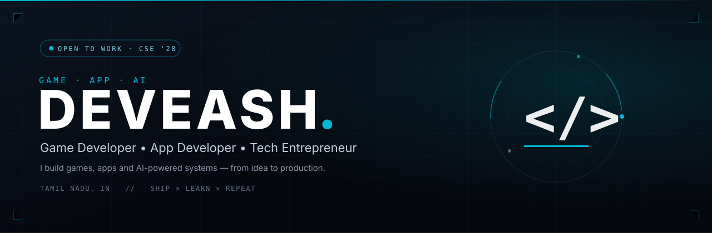

  

  <h1>Hey, I'm Deveash 👋</h1>

  
<strong>Game Developer • App Developer • Tech Entrepreneur</strong>

  
I build games, apps and AI-powered systems — from idea to production-ready products.

  

    
    
    
  

---

## About Me

I'm a 2nd-year CSE undergraduate based in Tamil Nadu, India. I focus on building real, working products — games, applications and AI-driven systems — rather than demos that never ship.

My direction is clear: go deep on game development (Unreal Engine + C++) while building sustainable tech products and client work around apps, web and applied AI.

---

## Currently Building

- Deepening game development fundamentals — gameplay systems and engine-level C++.
- Shipping client and product web work (business sites, studio sites, portfolios).
- Applied AI systems — chat backends, agents and automation that solve real problems.

---

## Tech Stack

**Languages**
`TypeScript` `JavaScript` `Python` `Java` `C++` `Dart`

**Frameworks**
`React` `Next.js` `Flutter` `Tailwind CSS` `FastAPI`

**Game Development**
`Unreal Engine` `C++` `Java` (gameplay logic) `SQLite` (game persistence)

**Backend / Cloud**
`Node.js` `Express` `MongoDB` `PostgreSQL` `Firebase` `SQLite` `Socket.IO` `JWT Auth` `Cloudflare Workers` `FCM Push`

**Tools**
`Git` `GitHub` `VS Code` `Gemini CLI` `OpenCode`

> Stack reflects technologies present across my repositories and shipped portfolio work.

---

## Featured Projects

### CrimeDetective — Java murder-mystery game
A full text-adventure investigation game: explore 9 mansion rooms, interrogate 4 suspects, analyze 15 evidence items in a forensics lab, and close the case with a ranked score. Persists progress with SQLite (JDBC) plus a file-based fallback, including a leaderboard.
- **Stack:** `Java` `SQLite` `JDBC`
- **Code:** [deveash123/CrimeDetective](https://github.com/deveash123/CrimeDetective)

### ChatFlow Backend — realtime chat API
Production-style realtime chat backend with JWT access + refresh rotation, one-to-one message persistence, Socket.IO messaging with typing and presence, delivery/seen states, offline FCM push, and Redis adapter support for horizontal scaling.
- **Stack:** `Node.js` `Express` `MongoDB` `Socket.IO` `JWT` `FCM`
- **Code:** [deveash123/chatflow-backend](https://github.com/deveash123/chatflow-backend)

### Water Hyacinth — AI + IoT concept platform
An early-stage concept for detecting water hyacinth with computer vision and IoT, aimed at environmental restoration and sustainable material reuse. Currently a prototype direction, not a finished product.
- **Stack:** `AI / Computer Vision` `IoT` (concept stage)
- **Code:** [deveash123/water-hyacinth](https://github.com/deveash123/water-hyacinth)

### Kavi Air Tech — client business website
A fast, dependency-free single-page website for a local business: services, contact actions and a mobile-first layout in one self-contained page.
- **Stack:** `HTML` `CSS` `JavaScript`
- **Code:** [deveash123/kavi-tech-client-](https://github.com/deveash123/kavi-tech-client-)

<a href="https://github.com/deveash123?tab=repositories">More repositories on my profile →</a>

---

## GitHub Activity

  
  

---

## Current Goals

- [ ] Master Unreal Engine + C++ gameplay systems and performance.
- [ ] Ship production-grade AI agents with measurable real-world use.
- [ ] Grow steady freelance/product revenue through small, well-built releases.

---

## Connect

Portfolio, LinkedIn and email are the fastest ways to reach me. If you have a game, app or AI project in mind — let's talk.

- **Portfolio:** [gdeash.deveash.workers.dev](https://gdeash.deveash.workers.dev)
- **LinkedIn:** [linkedin.com/in/deveashg](https://linkedin.com/in/deveashg/)
- **Email:** [gdeveash@gmail.com](mailto:gdeveash@gmail.com)

---

© 2026 Deveash · Tamil Nadu, India

